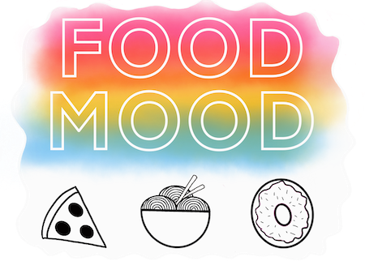
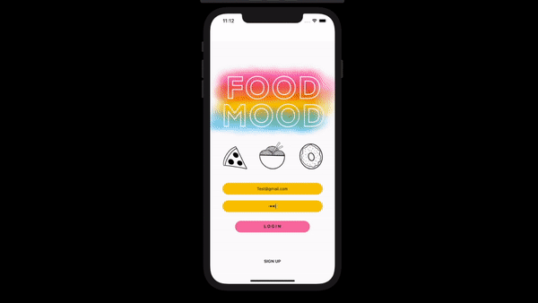

<!-- PROJECT LOGO -->
<br />
<p align="center">
  <a href="https://github.com/christina003/food_mood">
    
  </a>

  <p align="center">
   What are you in the mood for? :doughnut: :hamburger: :oden: :sushi: :pizza: <br />
    <a href="https://github.com/christina003/food_mood"><strong>Explore the docs »</strong></a>
    <br />
    <br />
    <a href="https://github.com/christina003/food_mood">
    </a>
  </p>
</p>

<!-- TABLE OF CONTENTS -->
<details open="open">
  <summary><h2 style="display: inline-block">Table of Contents</h2></summary>
  <ol>
    <li>
      <a href="#about-the-project">About The Project</a>
      <ul>
        <li><a href="#built-with">Built With</a></li>
      </ul>
    </li>
    <li>
      <a href="#getting-started">Getting Started</a>
      <ul>
        <li><a href="#prerequisites">Prerequisites</a></li>
        <li><a href="#installation">Installation</a></li>
      </ul>
    </li>
    <li><a href="#contact">Contact</a></li>
  </ol>
</details>

<!-- ABOUT THE PROJECT -->

## About The Project
  <p align="left">
  A mobile application where you can search through restaurants near you and swipe on what sounds good! <br />
  Working on: <br />
  :tomato: Group functionality to match based on what connected users are in the mood for <br /><br />
  </p>

### Built With

- []() React Native
- []() Expo
- []() Express
- []() MongoDB

<!-- GETTING STARTED -->

## Getting Started

To get a local copy up and running follow these simple steps.

### Prerequisites

- npm
  ```sh
  npm install npm@latest -g
  ```
- expo
  ```sh
  npm install -g expo-cli
  ```

### Installation

1. Clone the repo
   ```sh
   git clone https://github.com/christina003/food_mood.git
   ```
2. Install NPM packages
   ```sh
   npm install
   cd backend
   npm install
   ```
3. Start Application
   ```sh
   expo start
   ```
4. Start Server
   ```sh
   cd backend
   npm start
   ```

<!-- CONTACT -->

## Contact

[](https://www.linkedin.com/in/csantos91/)

[](mailto:christina.santos823@gmail.com)

Project Link: [https://github.com/christina003/food_mood](https://github.com/christina003/food_mood)

<!-- MARKDOWN LINKS & IMAGES -->
<!-- https://www.markdownguide.org/basic-syntax/#reference-style-links -->

[contributors-shield]: https://img.shields.io/github/contributors/github_username/repo.svg?style=for-the-badge
[contributors-url]: https://github.com/github_username/repo/graphs/contributors
[forks-shield]: https://img.shields.io/github/forks/github_username/repo.svg?style=for-the-badge
[forks-url]: https://github.com/github_username/repo/network/members
[stars-shield]: https://img.shields.io/github/stars/github_username/repo.svg?style=for-the-badge
[stars-url]: https://github.com/github_username/repo/stargazers
[issues-shield]: https://img.shields.io/github/issues/github_username/repo.svg?style=for-the-badge
[issues-url]: https://github.com/github_username/repo/issues
[license-shield]: https://img.shields.io/github/license/github_username/repo.svg?style=for-the-badge
[license-url]: https://github.com/github_username/repo/blob/master/LICENSE.txt
[linkedin-shield]: https://img.shields.io/badge/-LinkedIn-black.svg?style=for-the-badge&logo=linkedin&colorB=555
[linkedin-url]: https://linkedin.com/in/github_username
